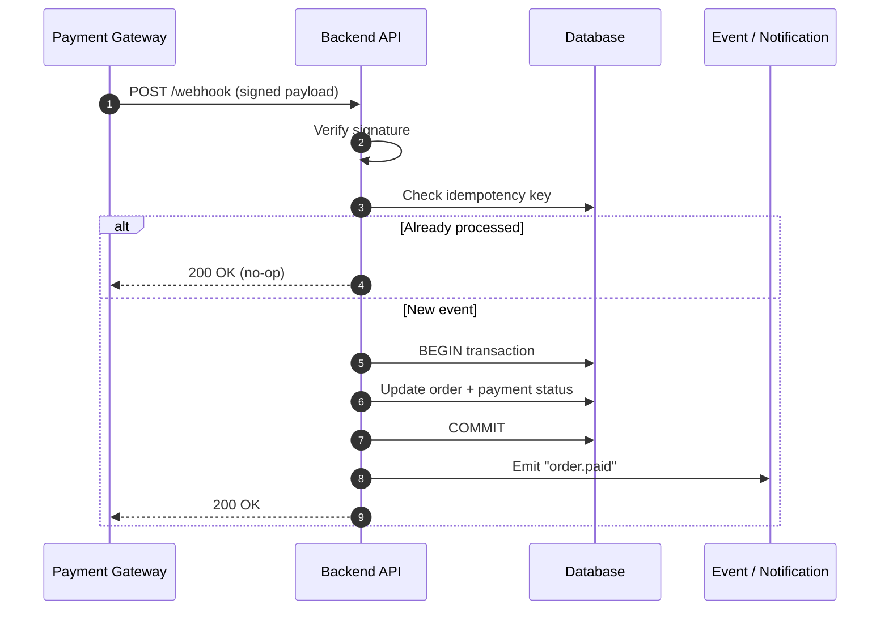

 

  

  

## 👋 About Me

I'm a **backend-focused developer** who builds web applications, APIs, and internal systems. 
Most of my recent work means shipping complete products, so I go fullstack when needed, 
but backend engineering is where I want to be.

**What I care about**

🔌 **API design**: clean contracts, predictable behavior 
🗄️ **Database architecture**: schemas that survive real traffic 
⚙️ **Backend services**: reliable, observable, maintainable 
🔗 **System integration**: payments, messaging, third-party services 
🤖 **Workflow automation**: replacing manual busywork with software

 

## 🚧 Currently Building

<table align="center">
<tr>
<td width="50%" valign="top" align="center">

### 🏢 Internal Platforms & Business Systems

Private projects built with:

Node.js + Express backend services 
Next.js applications 
MongoDB + Mongoose data modeling 
PostgreSQL databases 
Authentication & authorization 
External service integrations

</td>
<td width="50%" valign="top" align="center">

### 📚 Developer Documentation

Documentation platforms built with:

Astro 
Markdown-based content 
Modern frontend tooling

</td>
</tr>
</table>

 

## 🧠 Engineering Focus

<table align="center">
<tr><th align="left">Problem</th><th align="left">Approach</th></tr>
<tr><td>💳 Reliable payments</td><td>Webhook verification, idempotency handling, safe transaction flow</td></tr>
<tr><td>🔄 Concurrent data updates</td><td>Database transactions and consistency checks</td></tr>
<tr><td>📡 Real-time communication</td><td>Event-based integration between services</td></tr>
<tr><td>🤖 Business automation</td><td>Internal tools that reduce manual workflows</td></tr>
</table>

<b>💡 Example: how I think about a payment webhook</b>

 

 

## ⭐ Featured Project

<table align="center">
<tr>
<td width="55%" valign="middle" align="center">

### yt-to-mp3

A **local-first** media conversion application built with Go and React.

🐹 Go backend 
⚛️ Embedded React interface 
🗃️ SQLite-based job processing 
👷 Worker pool architecture 
📶 Real-time progress updates 
📦 Cross-platform builds

<a href="https://github.com/irfanadwifangga/yt-to-mp3">View repository →</a>

</td>
<td width="45%" valign="middle" align="center">

<a href="https://github.com/irfanadwifangga/yt-to-mp3">
<picture>
<source media="(prefers-color-scheme: dark)" srcset="https://github-stats-extended.vercel.app/api/pin?username=irfanadwifangga&repo=yt-to-mp3&theme=dark_github_repocard&hide_border=true">

</picture>
</a>

</td>
</tr>
</table>

 

## 🛠️ Tech Stack

**Backend** 

**Frontend** 

**Database** 

**Testing & CI/CD** 

**Tools** 

 

## 📊 GitHub Stats

<a href="https://github.com/irfanadwifangga">
<picture>
<source media="(prefers-color-scheme: dark)" srcset="https://github-stats-extended.vercel.app/api?username=irfanadwifangga&show_icons=true&include_all_commits=true&rank_icon=github&theme=dark_github&hide_border=true&show=prs_merged_percentage,prs_reviewed">

</picture>
</a>
<a href="https://github.com/irfanadwifangga">
<picture>
<source media="(prefers-color-scheme: dark)" srcset="https://github-stats-extended.vercel.app/api/top-langs?username=irfanadwifangga&layout=compact&langs_count=8&theme=dark_github&hide_border=true">

</picture>
</a>

  

<picture>
<source media="(prefers-color-scheme: dark)" srcset="https://streak-stats.demolab.com/?user=irfanadwifangga&theme=dark&hide_border=true">

</picture>

 

## 🤝 Let's Work Together

I'm open to **remote backend and fullstack opportunities**. 
If you have an API to design, a system to integrate, or a workflow worth automating, let's talk.

 

